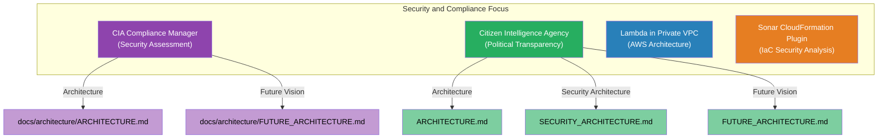

# James Pether Sörling

## Security & Open Source Expert | Cloud Security Specialist | Information Security Professional

  
  
  
  

---

### About Me

Experienced technology professional specializing in information security and delivery of secure cloud systems. Strong advocate for transparency in organizations and committed to ensuring robust security posture for modern applications.

I develop advanced open source tools focused on:
- 🔐 **CIA Triad** (Confidentiality, Integrity, Availability)
- 📊 **Compliance Management**
- 🔍 **Political Transparency**
- ☁️ **Secure AWS Cloud Architectures**

---

### Featured Projects

<table>
  <tr>
    <td width="50%">
      <h3 align="center">🔐 CIA Compliance Manager</h3>
      

        
        
<i>Security assessment platform for the CIA triad with compliance mapping to regulatory frameworks</i>

        

          <a href="https://github.com/Hack23/cia-compliance-manager/blob/main/docs/architecture/ARCHITECTURE.md">📐 Architecture</a> |
          <a href="https://hack23.com/cia-compliance-manager-features.html">✨ Features</a> |
          <a href="https://hack23.github.io/cia-compliance-manager/">🚀 Live Demo</a>
        

        
        
        
      

    </td>
    <td width="50%">
      <h3 align="center">🔍 Citizen Intelligence Agency</h3>
      

        
        
<i>Political transparency platform monitoring Swedish political activity with data-driven insights</i>

        

          <a href="https://github.com/Hack23/cia/blob/master/ARCHITECTURE.md">📐 Architecture</a> |
          <a href="https://hack23.com/cia-features.html">✨ Features</a> |
          <a href="https://github.com/Hack23/cia/blob/master/SECURITY_ARCHITECTURE.md">🔒 Security</a>
        

        
        
        
      

    </td>
  </tr>
  <tr>
    <td width="50%">
      <h3 align="center">☁️ Lambda in Private VPC</h3>
      

        
        
<i>Multi-region active/active site leveraging Resilience Hub policy compliance and runbooks</i>

        

          <a href="https://github.com/Hack23/lambda-in-private-vpc/blob/master/README.md">📑 Documentation</a> |
          <a href="https://github.com/Hack23/lambda-in-private-vpc/actions/workflows/main.yml">🔄 CI/CD</a>
        

        
        
      

    </td>
    <td width="50%">
      <h3 align="center">🧪 Sonar-CloudFormation-Plugin</h3>
      

        
        
<i>SonarQube plugin for analyzing AWS CloudFormation templates with security best practices</i>

        

          <a href="https://github.com/Hack23/sonar-cloudformation-plugin/blob/master/README.md">📑 Documentation</a> |
          <a href="http://mvnrepository.com/artifact/com.hack23.sonar/sonar-cloudformation-plugin">📦 Maven</a>
        

        
        
      

    </td>
  </tr>
</table>

---

### Architecture & Documentation

  

### Project Badges & Status

##### CIA Compliance Manager

##### Citizen Intelligence Agency

---

### Technologies & Skills

#### Cloud & Infrastructure

#### Backend & Data

#### Frontend & UI

#### Security & DevOps

---

### Notable Contributions

- As an open source contributor for cfn-nag, which performs infrastructure as code (IaC) static analysis of AWS CloudFormation, I developed a module that integrates CFN-nag into SonarQube.
- Speaker at [Javaforum Göteborg](https://www.youtube.com/watch?v=A_hq2Y03d6I)
- Guest on [Shift Left Like A Boss](https://www.youtube.com/watch?v=aYwSd1Wu28Q&ab_channel=Soluble/) security podcast
- Developer of [Sonar-CloudFormation-Plugin](https://github.com/Hack23/sonar-cloudformation-plugin)
- Featured in Computer Sweden and Riksdag och Departement for political transparency work
- Mentioned in National Democratic Institute survey on parliamentary monitoring organizations

---

### GitHub Stats & Activity

  
  

---

### Connect With Me

  
  
  
  

   
  

