# CEO/Founder Hack23 | Security & Open Source Expert | Cloud Security Specialist | Information Security Professional  

  
  
  
  

---

### CEO/Founder of Hack23 | 

Strong advocate for transparency in organizations, secure software development practices, and innovative open source solutions. 
Experienced security professional with over 30 years in information technology, specializing in security architecture, cloud security, and compliance.
Prior roles including Application Security Officer at Stena,Information Security Officer at Polestar and Senior Security Architect at WirelessCar.

---

## 🔐 Commitment to Transparency and Security

At Hack23 AB, we believe that true security comes through transparency and demonstrable practices. Our Information Security Management System (ISMS) is publicly available, showcasing our commitment to security excellence and organizational transparency.

<table>
  <tr>
    <td width="50%">
      

        <h3>📋 Public ISMS Repository</h3>
        
Complete Information Security Management System documentation

        
      

    </td>
    <td width="50%">
      

        <h3>🔒 Information Security Policy</h3>
        
Enterprise-grade security framework and governance

        
      

    </td>
  </tr>
</table>

### 🏆 Security Through Transparency

Our approach to cybersecurity consulting is built on a foundation of transparent practices:

- **🔍 Open Documentation**: Complete ISMS framework available for review
- **📋 Policy Transparency**: Detailed security policies and procedures publicly accessible  
- **🎯 Demonstrable Expertise**: Our own security implementation serves as a live demonstration
- **🔄 Continuous Improvement**: Public documentation enables community feedback and enhancement

  
<em>"Our commitment to transparency extends to our security practices - demonstrating that true security comes from robust processes, continuous improvement, and a culture where security considerations are integrated into every business decision."</em>

  
<strong>— James Pether Sörling, CEO/Founder</strong>

---

### 🍎 Discordian Cybersecurity Insights

Explore information security, ISMS policies, and cybersecurity best practices through the unique **Discordian lens** inspired by the *Illuminatus!* trilogy. **"Think for yourself, question authority."**

<table>
  <tr>
    <td width="100%">
      

        <h3>📖 Security Blog: 30+ Posts</h3>
        
Everything You Know About Security Is a Lie — Nation-state capabilities, approved crypto paradox, and Chapel Perilous initiation. Complete ISMS coverage with radical transparency.

        
      

    </td>
  </tr>
</table>

**Featured Content:**
- 🎭 **[Discordian Manifesto](https://hack23.com/discordian-cybersecurity.html)** - Everything You Know About Security Is a Lie
- 📚 **Complete ISMS Coverage** - All 30 posts link directly to [ISMS-PUBLIC repository](https://github.com/Hack23/ISMS-PUBLIC)
- 🍎 **Illuminatus! Style** - FNORD detection, Chapel Perilous references, 23 FNORD 5 signatures

*All hail Eris! All hail Discordia!* 🍎

---

### Professional Certifications

  
  
  
  

---

# 🔥 Black Trigram (흑괘)

<table>
  <tr>
    <td width="120" align="center">
      
      

        
      

    </td>
    <td>
      
<strong>Realistic 2D precision combat simulator</strong> inspired by traditional Korean martial arts, focusing on precise anatomical targeting, authentic combat techniques, and detailed physics-based interactions.

      

        
        
      

      

        <a href="https://blacktrigram.com"><strong>🌐 Official Website</strong></a> •
        <a href="https://github.com/Hack23/blacktrigram"><strong>📂 Repository</strong></a> •
        <a href="https://hack23.com/black-trigram-docs.html"><strong>📚 Documentation</strong></a>
      

    </td>
  </tr>
</table>

### 🔐 CIA Compliance Manager

<table>
  <tr>
    <td width="120" align="center">
      
      

        
      

    </td>
    <td>
      
<strong>Security assessment platform for the CIA triad (Confidentiality, Integrity, Availability)</strong> with business impact analysis and compliance mapping to regulatory frameworks like NIST, ISO, GDPR, HIPAA, and SOC2.

      

        
        
        
      

      

        <a href="https://hack23.github.io/cia-compliance-manager/"><strong>🚀 Live Demo</strong></a> •
        <a href="https://github.com/Hack23/cia-compliance-manager"><strong>📂 Repository</strong></a> •
        <a href="https://hack23.com/cia-compliance-manager-features.html"><strong>✨ Features</strong></a> •
        <a href="https://hack23.com/cia-compliance-manager-docs.html"><strong>📚 Documentation</strong></a>
      

    </td>
  </tr>
</table>

### 🔍 Citizen Intelligence Agency

<table>
  <tr>
    <td width="120" align="center">
      
      

        
      

    </td>
    <td>
      
<strong>Political transparency platform</strong> monitoring Swedish political activity with data-driven insights, analytics, dashboard visualizations, and accountability metrics.

      

        
        
        
      

      

        <a href="https://github.com/Hack23/cia"><strong>📂 Repository</strong></a> •
        <a href="https://hack23.com/cia-features.html"><strong>✨ Features</strong></a> •
        <a href="https://hack23.com/cia-docs.html"><strong>📚 Documentation</strong></a>
      

    </td>
  </tr>
</table>

### ☁️ Lambda in Private VPC

<table>
  <tr>
    <td width="120" align="center">
      
      

        
      

    </td>
    <td>
      
<strong>Enterprise-grade multi-region active/active architecture</strong> with near-zero recovery time, comprehensive DNS failover, and AWS Resilience Hub policy compliance for mission-critical applications.

      

        
        
      

      

        <a href="https://github.com/Hack23/lambda-in-private-vpc"><strong>📂 Repository</strong></a> •
        <a href="https://github.com/Hack23/lambda-in-private-vpc#-architecture-design"><strong>🏗️ Architecture</strong></a>
      

    </td>
  </tr>
</table>

### 🧪 Sonar-CloudFormation-Plugin

<table>
  <tr>
    <td width="120" align="center">
      
      

        
      

    </td>
    <td>
      
<strong>SonarQube plugin for analyzing AWS CloudFormation templates</strong> with security best practices based on NIST, CWE, and ISO standards.

      

        
        
      

      

        <a href="https://github.com/Hack23/sonar-cloudformation-plugin"><strong>📂 Repository</strong></a> •
        <a href="http://mvnrepository.com/artifact/com.hack23.sonar/sonar-cloudformation-plugin"><strong>📦 Maven Central</strong></a>
      

    </td>
  </tr>
</table>

## 🔑 Security Services

Professional cybersecurity consulting services delivered remotely or in-person in Gothenburg. Drawing from over three decades of experience in software development and security architecture, we deliver practical security solutions that integrate seamlessly into your development processes without hindering innovation.

---

## 📋 Service Overview

<table>
  <tr>
    <td>🌐 Availability</td>
    <td>Remote or in-person (Gothenburg)</td>
  </tr>
  <tr>
    <td>💰 Pricing</td>
    <td>Contact for pricing</td>
  </tr>
  <tr>
    <td>🏢 Company</td>
    <td>Hack23 AB (Org.nr 5595347807)</td>
  </tr>
  <tr>
    <td>📧 Contact</td>
    <td>LinkedIn</td>
  </tr>
</table>

---

## 🎯 Core Service Areas

<table>
  <tr>
    <th>Area</th>
    <th>Services</th>
    <th>Ideal for</th>
  </tr>
  <tr>
    <td>🏗️ Security Architecture & Strategy</td>
    <td>
      Enterprise Security Architecture: Design and implementation of comprehensive security frameworks 
      Risk Assessment & Management: Systematic identification and mitigation of security risks 
      Security Strategy Development: Alignment of security initiatives with business objectives 
      Governance Framework Design: Policy development and security awareness programs
    </td>
    <td>Organizations needing strategic security leadership and architectural guidance</td>
  </tr>
  <tr>
    <td>☁️ Cloud Security & DevSecOps</td>
    <td>
      Secure Cloud Solutions: AWS security assessment and architecture (Advanced level) 
      DevSecOps Integration: Security seamlessly integrated into agile development processes 
      Infrastructure as Code Security: Secure CloudFormation, Terraform implementations 
      Container & Serverless Security: Modern application security best practices
    </td>
    <td>Development teams transitioning to cloud-native architectures with security focus</td>
  </tr>
  <tr>
    <td>🔧 Secure Development & Code Quality</td>
    <td>
      Secure SDLC Implementation: Building security into development lifecycles 
      CI/CD Security Integration: Automated security testing and validation 
      Code Quality & Security Analysis: Static analysis, vulnerability scanning 
      Supply Chain Security: SLSA Level 3 compliance, SBOM implementation
    </td>
    <td>Development teams seeking to embed security without slowing innovation</td>
  </tr>
</table>

---

## 🏆 Specialized Expertise

<table>
  <tr>
    <th>Category</th>
    <th>Services</th>
    <th>Value</th>
  </tr>
  <tr>
    <td>📋 Compliance & Regulatory</td>
    <td>
      Regulatory Compliance: GDPR, NIS2, ISO 27001 implementation 
      ISMS Design & Implementation: Information Security Management Systems 
      AI Governance: Emerging AI risk management frameworks 
      Audit Preparation: Documentation and evidence preparation
    </td>
    <td>Navigate complex regulatory landscapes with confidence</td>
  </tr>
  <tr>
    <td>🌐 Open Source Security</td>
    <td>
      Open Source Program Office: OSPO establishment and management 
      Vulnerability Management: Open source risk assessment and remediation 
      Security Tool Development: Custom security solutions and automation 
      Community Engagement: Open source security best practices
    </td>
    <td>Leverage open source securely while contributing to security transparency</td>
  </tr>
  <tr>
    <td>🎓 Security Culture & Training</td>
    <td>
      Security Awareness Programs: Building organization-wide security culture 
      Developer Security Training: Secure coding practices and methodologies 
      Leadership Security Briefings: Executive-level security understanding 
      Incident Response Training: Preparedness and response capability building
    </td>
    <td>Transform security from barrier to enabler through education and culture</td>
  </tr>
</table>

---

## 💡 Why Choose Hack23 Security Services?

Three decades of hands-on experience in software development and security architecture means we understand the real challenges development teams face. We don't just point out problems—we provide practical, implementable solutions that enhance security without slowing down innovation.

**Our approach:** Security should be seamlessly integrated into your existing processes, not bolted on afterward. We help organizations build a culture of security awareness where protection becomes a natural part of how teams work, not an obstacle to overcome.

**Passionate about transparency:** As advocates for open source security, we believe in sharing knowledge and building community. Our solutions are designed to be understandable, maintainable, and aligned with industry best practices.

### Project Architecture & Documentation

<table>
  <tr>
    <th>Project</th>
    <th>Current Architecture</th>
    <th>Security Architecture</th>
    <th>Future Vision</th>
  </tr>
  <tr>
    <td> CIA Compliance Manager</td>
    <td><a href="https://github.com/Hack23/cia-compliance-manager/blob/main/docs/architecture/ARCHITECTURE.md">🏛️ Architecture</a></td>
    <td><a href="https://github.com/Hack23/cia-compliance-manager/blob/main/docs/architecture/SECURITY_ARCHITECTURE.md">🔒 Security</a></td>
    <td><a href="https://github.com/Hack23/cia-compliance-manager/blob/main/docs/architecture/FUTURE_ARCHITECTURE.md">🔮 Future</a></td>
  </tr>
  <tr>
    <td> Citizen Intelligence Agency</td>
    <td><a href="https://github.com/Hack23/cia/blob/master/ARCHITECTURE.md">🏛️ Architecture</a></td>
    <td><a href="https://github.com/Hack23/cia/blob/master/SECURITY_ARCHITECTURE.md">🔒 Security</a></td>
    <td><a href="https://github.com/Hack23/cia/blob/master/FUTURE_ARCHITECTURE.md">🔮 Future</a></td>
  </tr>
</table>

<table>
  <tr>
    <th>Project</th>
    <th>Process Flows</th>
    <th>State Diagrams</th>
    <th>Mindmaps</th>
  </tr>
  <tr>
    <td> CIA Compliance Manager</td>
    <td><a href="https://github.com/Hack23/cia-compliance-manager/blob/main/docs/architecture/FLOWCHART.md">📊 Flowcharts</a></td>
    <td><a href="https://github.com/Hack23/cia-compliance-manager/blob/main/docs/architecture/STATEDIAGRAM.md">🔄 States</a></td>
    <td><a href="https://github.com/Hack23/cia-compliance-manager/blob/main/docs/architecture/MINDMAP.md">🧠 Mindmaps</a></td>
  </tr>
  <tr>
    <td> Citizen Intelligence Agency</td>
    <td><a href="https://github.com/Hack23/cia/blob/master/FLOWCHART.md">📊 Flowcharts</a></td>
    <td><a href="https://github.com/Hack23/cia/blob/master/STATEDIAGRAM.md">🔄 States</a></td>
    <td><a href="https://github.com/Hack23/cia/blob/master/MINDMAP.md">🧠 Mindmaps</a></td>
  </tr>
</table>

### Professional Experience & Skills

```mermaid
mindmap
  root)👨‍💼 James Pether Sörling(
    🔐 Information Security
      🛡️ Risk Assessment & Management
      🎓 CISSP / CISM Certified
      🏛️ Security Architecture Design
        🔒 Zero Trust
        🛡️ Defense-in-Depth
      ⚙️ Compliance Frameworks
        ISO 27001
        NIST 800-53
        VDA-ISA
        CIS Controls
        GDPR
      🚨 Security Operations
        Incident Response
        Vulnerability Management
        Security Monitoring
    ☁️ Cloud Security
      🌐 Multi-Cloud: AWS, Azure
      🏗️ Enterprise Architecture
        High Availability
        Multi-Region
        Resilience
      🛠️ Infrastructure as Code
        CloudFormation
        Terraform
      🔒 Secure Cloud Services
        Security Hub
        GuardDuty
        KMS
        WAF
    🗂️ Leadership & Governance
      👨‍💼 Information Security Officer
      🏛️ Security Architect
      📝 Policy Development
      ⚖️ IT Governance
      👥 Team Leadership
      🌐 Open Source Program Office
      🤖 AI Governance
    💻 Software Engineering
      🛠️ Secure Development (SSDLC)
      🌱 Java / Spring / React
      ⚙️ Automated Testing
      🔄 CI/CD Pipelines
      📈 Code Quality
        SLSA Level 3
        SonarQube
    🌍 Open Source Leadership
      👨‍🔬 Project Maintainer
      🤝 Community Contributor
      🛡️ Security Tooling
      👀 Code Review
```

```mermaid
mindmap
  root((👨‍💼 James Pether Sörling))
    🔐 Information & Security Leadership
      👨‍💼 CISO / ISO Roles
      🛡️ Security Architecture
      🧩 CIA Triad Implementation
      🛠️ Policy Development & Governance
      📊 Risk Management
      🔍 Audit & Compliance Oversight
      🤖 AI Governance
      🌐 Open Source Program Office
    🏛️ Frameworks & Compliance
      📄 ISO 27001
      📄 NIST 800-53
      📄 VDA-ISA
      📄 CIS Controls
      🏷️ Data Protection / GDPR
      📋 ISMS Implementation
      🧪 Continuous Improvement
    ☁️ Cloud & Platform Security
      🌐 Multi-Cloud (AWS / Azure)
      🏗️ Enterprise & Reference Architectures
        🌍 Multi-Region Design
        🔁 Resilience & Failover
        ♻️ High Availability Patterns
      🔒 Secure Cloud Services
        Security Hub
        GuardDuty
        KMS
        WAF
      🧱 Network & VPC Security
      🔑 IAM / Least Privilege
    🛠️ Infrastructure as Code
      🧾 CloudFormation
      🛠️ Terraform
      🔄 GitOps / Pipelines
      🔍 Template Scanning
      📦 Supply Chain (SLSA Level 3)
    💻 Software Engineering
      ☕ Java / Spring
      ⚛️ React / TypeScript
      🐘 PostgreSQL
      🔄 CI/CD Automation
      🧪 Automated Testing
      🧵 Secure SDLC (SSDLC)
      📈 Code Quality (SonarQube)
    🔬 Security Operations & Assurance
      🚨 Incident Response
      🕵️ Vulnerability Management
      📈 Security Monitoring
      🧪 Threat Modeling
      📜 Logging & SIEM Use
    🌍 Open Source Leadership
      📋 CIA Compliance Manager
      🏛️ Citizen Intelligence Agency
      🧩 Sonar-CloudFormation-Plugin
      🔧 cfn-nag Contributions
      🤝 Community Engagement
      👀 Code Review / Security Tooling
    🏆 Certifications & Recognition
      🎓 CISSP
      🎓 CISM
      🥇 AWS Security Specialty
      🥇 AWS Solutions Architect Professional
      🛡️ SLSA Level 3 Attestations
    🚀 Strategic Impact
      🔓 Transparency Advocacy
      🧭 Security-by-Design Enablement
      🧠 Knowledge Sharing / Speaking
      📢 Public Policy & Civic Tech
```

### Technology & Skills

#### Security & Compliance

#### Cloud & Infrastructure

#### Development & Languages

#### DevOps & Tools

#### Leadership & Management

#### Additional Skills

### Career Highlights

## Badges

### Black Trigram Badges

### CIA Compliance Manager Badges

### Citizen Intelligence Agency Badges

### Sonar-CloudFormation-Plugin Badges

### Lambda in Private VPC Badges

---

### Notable Contributions & Appearances

- Information Security Officer at Polestar, leading security practices and the Open Source Program Office
- Senior Security Architect at WirelessCar, supporting secure delivery practices and security risk management
- Open source contributor for cfn-nag, developing integration with SonarQube for CloudFormation security analysis
- Speaker at [Javaforum Göteborg](https://www.youtube.com/watch?v=A_hq2Y03d6I) on secure architecture patterns
- Guest on [Shift Left Like A Boss](https://www.youtube.com/watch?v=aYwSd1Wu28Q&ab_channel=Soluble/) security podcast
- Featured in Computer Sweden and Riksdag och Departement for political transparency work
- Mentioned in National Democratic Institute survey on parliamentary monitoring organizations
- Operated Equal Rites BBS in the 1990s, part of Fidonet (Node 2:203/454)
- 

---

## 🗺️ Site Map Overview

Hack23.com is a static, multi-language HTML/CSS site deployed to AWS S3 + CloudFront.  
For the **authoritative, always up-to-date sitemap**, use the live page:

- **🔗 Live Sitemap:** https://hack23.com/sitemap.html  

The sections below mirror the structure of [`sitemap.html`](https://hack23.com/sitemap.html) with **direct, HTTPS links** and **icons aligned with the ISMS Style Guide**.

---

### 🏠 Home & Company

**Mission, values, company details, and CIA Triad foundations.**

- 🏠 **Homepage:** https://hack23.com/index.html  
- 🧭 **Why Hack23?:** https://hack23.com/why-hack23.html  
- 🔐 **CIA Triad FAQ (Confidentiality, Integrity, Availability):**  
  https://hack23.com/cia-triad-faq.html  

---

### 🔑 Security Services

Professional cybersecurity consulting focused on **security architecture, cloud security, DevSecOps, and compliance** — with evidence-based practices and public ISMS.

- 🔑 **All Services (overview):** https://hack23.com/services.html  
  - 🏗️ **Security Architecture & Strategy:**  
    https://hack23.com/services.html#security-architecture  
  - ☁️ **Cloud Security & DevSecOps:**  
    https://hack23.com/services.html#cloud-security  
  - 📋 **Compliance & Regulatory:**  
    https://hack23.com/services.html#compliance  
- 🧾 **Security Assessment Checklist:**  
  https://hack23.com/security-assessment-checklist.html  

---

### 🚀 Projects (Open-Source & Reference Implementations)

Open-source and reference projects used as **live demonstrations of secure architecture, transparency, and practical security**.

#### 🎮 Black Trigram (Security-Aware Game)

Realistic 2D precision combat simulator based on traditional Korean martial arts, used as a **security-aware game and educational platform**.

- 🎮 **Overview:** https://hack23.com/black-trigram.html  
- ⭐ **Features:** https://hack23.com/black-trigram-features.html  
- 📚 **Documentation:** https://hack23.com/black-trigram-docs.html  

#### 🏛️ Citizen Intelligence Agency (CIA)

Open-source parliamentary monitoring and OSINT platform analyzing Swedish politics.

- 🏛️ **Overview:** https://hack23.com/cia-project.html  
- ⭐ **Features:** https://hack23.com/cia-features.html  
- 📚 **Documentation:** https://hack23.com/cia-docs.html  

#### 📋 CIA Compliance Manager

Browser-based compliance and CIA-triad assessment tool with no backend, focused on **risk, impact, and framework mapping**.

- 📋 **Overview:** https://hack23.com/compliance-manager.html  
- ⭐ **Features:** https://hack23.com/cia-compliance-manager-features.html  
- 📚 **Documentation:** https://hack23.com/cia-compliance-manager-docs.html  

---

### 🍎 Discordian Cybersecurity Blog & Insights

All blog content is centrally indexed here:

- 📚 **All Blog Posts:** https://hack23.com/blog.html  

The blog blends **ISMS-aligned policies** with a **Discordian, Illuminatus!-style narrative**, making complex security concepts accessible while still professionally mapped to the public ISMS.

#### 🎭 Core Manifesto & Philosophy

- 🎭 **Discordian Cybersecurity Manifesto:**  
  https://hack23.com/discordian-cybersecurity.html  

Representative themes (see `blog.html` for the full list and latest updates):

- 🧠 **Everything You Know About Security Is a Lie**  
- 🏛️ **The Security-Industrial Complex**  
- 🔒 **Question Authority: Crypto Approved By Spies**  
- 🏷️ **Think For Yourself: Classification & Data Handling**  

#### 🏛️ CIA Project Series

Architecture, security, and financial/operational views of the **Citizen Intelligence Agency** platform:

- 🏗️ **CIA Architecture:** https://hack23.com/blog-cia-architecture.html  
- 🛡️ **CIA Security (Defense Through Transparency):**  
  https://hack23.com/blog-cia-security.html  
- 🔄 **CIA Workflows (CI/CD & State Machines):**  
  https://hack23.com/blog-cia-workflows.html  
- 🧠 **CIA Mindmaps (Conceptual Sacred Geometry):**  
  https://hack23.com/blog-cia-mindmaps.html  
- 🔍 **CIA OSINT Intelligence:**  
  https://hack23.com/blog-cia-osint-intelligence.html  
- 🔮 **CIA Future Security (Post-quantum & AI):**  
  https://hack23.com/blog-cia-future-security.html  
- 💰 **CIA Financial Strategy – “$24.70/Day Democracy”:**  
  https://hack23.com/blog-cia-financial-strategy.html  
- 🌍 **CIA Business Case – Global News:**  
  https://hack23.com/blog-cia-business-case-global-news.html  
- 📰 **CIA Swedish Media Election 2026:**  
  https://hack23.com/blog-cia-swedish-media-election-2026.html  
- 📢 **CIA Alternative Media Discordian 2026:**  
  https://hack23.com/blog-cia-alternative-media-discordian-2026.html  

#### 🎮 Black Trigram Series

Deep dives into the **architecture, biomechanics, and future roadmap** of Black Trigram:

- 🏗️ **Architecture:** https://hack23.com/blog-trigram-architecture.html  
- 🥋 **Combat & Vital Points:**  
  https://hack23.com/blog-trigram-combat.html  
- 🔮 **Future (VR & Immersive Training):**  
  https://hack23.com/blog-trigram-future.html  

#### 📋 Compliance Manager Series

Applies the **CIA triad, STRIDE, and adaptive defense** to real-world compliance tooling:

- 🏗️ **Compliance Architecture:**  
  https://hack23.com/blog-compliance-architecture.html  
- 🛡️ **Compliance Security (STRIDE Through Five Dimensions):**  
  https://hack23.com/blog-compliance-security.html  
- 🔮 **Compliance Future (Context-Aware Defense):**  
  https://hack23.com/blog-compliance-future.html  

#### 🧪 Code Analysis: “George Dorn” Series

Evidence-based code reviews based on the **actual cloned repositories**, not just documentation:

- 📊 **CIA Code Analysis:**  
  https://hack23.com/blog-george-dorn-cia-code.html  
- 📊 **Compliance Manager Code Analysis:**  
  https://hack23.com/blog-george-dorn-compliance-code.html  
- 📊 **Black Trigram Code Analysis:**  
  https://hack23.com/blog-george-dorn-trigram-code.html  

#### 🧠 Thought Leadership & Election Analysis

- 🧬 **Automated Convergence (Security, Cloud, DevSecOps):**  
  https://hack23.com/blog-automated-convergence.html  
- 🧠 **Information Hoarding Destroys Data Integrity:**  
  https://hack23.com/blog-information-hoarding.html  
- 🛡️ **Public ISMS Benefits:**  
  https://hack23.com/blog-public-isms-benefits.html  
- 🗳️ **Swedish Election 2026 – Data-Driven Analysis:**  
  https://hack23.com/swedish-election-2026.html  

For the **full and current list of posts**, see:  
👉 https://hack23.com/blog.html  

---

### 🛡️ ISMS & Security Policies (Public ISMS)

The “Discordian” documents on hack23.com mirror and explain the **formal ISMS-PUBLIC repository** in a more narrative, accessible style.  
Key entry points:

- 🔐 **Information Security Policy:**  
  https://hack23.com/discordian-info-sec-policy.html  
- 🌐 **ISMS Transparency (What is Public vs. Redacted):**  
  https://hack23.com/discordian-isms-transparency.html  
- 🔄 **ISMS Review & Continuous Improvement:**  
  https://hack23.com/discordian-isms-review.html  
- 📋 **Compliance Overview:**  
  https://hack23.com/discordian-compliance.html  
- 🧭 **Compliance Frameworks (ISO 27001, NIST, CIS, etc.):**  
  https://hack23.com/discordian-compliance-frameworks.html  

Representative domains (see [`sitemap.html`](https://hack23.com/sitemap.html) for the complete tree):

- 📉 **Risk Management:**  
  https://hack23.com/discordian-risk-assessment.html  
  https://hack23.com/discordian-risk-register.html  
  https://hack23.com/discordian-threat-modeling.html  

- 🔑 **Access & Identity:**  
  https://hack23.com/discordian-access-control.html  
  https://hack23.com/discordian-remote-access.html  
  https://hack23.com/discordian-acceptable-use.html  

- 🏷️ **Data Protection & Classification:**  
  https://hack23.com/discordian-data-protection.html  
  https://hack23.com/discordian-data-classification.html  
  https://hack23.com/discordian-classification.html  
  https://hack23.com/discordian-privacy.html  
  https://hack23.com/discordian-crypto.html  

- 🌐 **Technical Security:**  
  https://hack23.com/discordian-network-security.html  
  https://hack23.com/discordian-cloud-security.html  
  https://hack23.com/discordian-email-security.html  
  https://hack23.com/discordian-mobile-device.html  
  https://hack23.com/discordian-vuln-mgmt.html  

- 🛠️ **Development & AI:**  
  https://hack23.com/discordian-secure-dev.html  
  https://hack23.com/discordian-ai-policy.html  
  https://hack23.com/discordian-llm-security.html  
  https://hack23.com/discordian-open-source.html  

- ⚙️ **Operations:**  
  https://hack23.com/discordian-change-mgmt.html  
  https://hack23.com/discordian-asset-mgmt.html  
  https://hack23.com/discordian-monitoring-logging.html  
  https://hack23.com/discordian-backup-recovery.html  

- 🔄 **Business Continuity & Incident Response:**  
  https://hack23.com/discordian-business-continuity.html  
  https://hack23.com/discordian-disaster-recovery.html  
  https://hack23.com/discordian-incident-response.html  

- 🏛️ **Governance & Stakeholders:**  
  https://hack23.com/discordian-security-strategy.html  
  https://hack23.com/discordian-security-metrics.html  
  https://hack23.com/discordian-security-training.html  
  https://hack23.com/discordian-stakeholders.html  
  https://hack23.com/discordian-business-value.html  

- 🤝 **Third Party & Supply Chain:**  
  https://hack23.com/discordian-third-party.html  
  https://hack23.com/discordian-supplier-reality.html  

- 🏢 **Physical & Facilities:**  
  https://hack23.com/discordian-physical-security.html  

- ⚖️ **Regulatory (e.g., EU Cyber Resilience Act):**  
  https://hack23.com/discordian-cra.html  
  https://hack23.com/discordian-cra-conformity.html  

For the **canonical policy set and machine-verifiable versions**, see the public ISMS repository:  
🔓 https://github.com/Hack23/ISMS-PUBLIC  

---

### 🌐 Languages (Internationalization)

Hack23.com supports multiple languages, following the `_sv` / `_ko` conventions and language-specific sitemap pages.

#### 🇬🇧 English (default)

- 🗺️ **Sitemap (EN):** https://hack23.com/sitemap.html  

#### 🇸🇪 Swedish

- 🏠 **Homepage (SV):** https://hack23.com/index_sv.html  
- 🗺️ **Sitemap (SV):** https://hack23.com/sitemap_sv.html  
- 🔑 **Services (SV):** https://hack23.com/services_sv.html  
- 🧭 **Why Hack23 (SV):** https://hack23.com/why-hack23_sv.html  
- 🔐 **CIA Triad FAQ (SV):** https://hack23.com/cia-triad-faq_sv.html  
- 🏛️ **CIA Features / Docs (SV):**  
  https://hack23.com/cia-features_sv.html  
  https://hack23.com/cia-docs_sv.html  
- 📋 **CIA Compliance Manager Features / Docs (SV):**  
  https://hack23.com/cia-compliance-manager-features_sv.html  
  https://hack23.com/cia-compliance-manager-docs_sv.html  
- 📚 **Selected Blog Translations (SV):**  
  https://hack23.com/blog-public-isms-benefits_sv.html  
  https://hack23.com/blog-cia-swedish-media-election-2026_sv.html  
  https://hack23.com/swedish-election-2026_sv.html  

#### 🇰🇷 Korean

- 🏠 **Homepage (KO):** https://hack23.com/index_ko.html  
- 🗺️ **Sitemap (KO):** https://hack23.com/sitemap_ko.html  
- 🔑 **Services (KO):** https://hack23.com/services_ko.html  
- 🎮 **Black Trigram Features / Docs (KO):**  
  https://hack23.com/black-trigram-features_ko.html  
  https://hack23.com/black-trigram-docs_ko.html  

#### 🇳🇱 Dutch

- 🗺️ **Sitemap (NL):** https://hack23.com/sitemap_nl.html  

#### 🇩🇪 German

- 🗺️ **Sitemap (DE):** https://hack23.com/sitemap_de.html  

#### 🇫🇷 French

- 🗺️ **Sitemap (FR):** https://hack23.com/sitemap_fr.html  

#### 🇯🇵 Japanese

- 🗺️ **Sitemap (JA):** https://hack23.com/sitemap_ja.html  

#### 🇨🇳 Chinese

- 🗺️ **Sitemap (ZH):** https://hack23.com/sitemap_zh.html  

---

### 🔧 Technical Resources

Technical endpoints and repositories powering the public site:

- 🗺️ **XML Sitemap (for crawlers):** https://hack23.com/sitemap.xml  
- 🤖 **robots.txt:** https://hack23.com/robots.txt  

**GitHub Repositories:**

- 🔓 **Public ISMS:** https://github.com/Hack23/ISMS-PUBLIC  
- 🖥️ **Homepage Source:** https://github.com/Hack23/homepage  

### Connect With Me

  
  
  
  

   
  

