# CEO/Founder Hack23 | Security & Open Source Expert | Cloud Security Specialist | Information Security Professional  

  
  
  
  

---

### CEO/Founder of Hack23 | 

Strong advocate for transparency in organizations, secure software development practices, and innovative open source solutions. 
Experienced security professional with over 30 years in information technology, specializing in security architecture, cloud security, and compliance.
Prior roles including Application Security Officer at Stena, Information Security Officer at Polestar and Senior Security Architect at WirelessCar.

---

## 🔐 Commitment to Transparency and Security

At Hack23 AB, we believe that true security comes through transparency and demonstrable practices. Our Information Security Management System (ISMS) is publicly available, showcasing our commitment to open security practices.

<table>
  <tr>
    <td width="50%">
      

        <h3>📋 Public ISMS Repository</h3>
        
Complete Information Security Management System documentation

        
      

    </td>
    <td width="50%">
      

        <h3>🔒 Information Security Policy</h3>
        
Enterprise-grade security framework and governance

        
      

    </td>
  </tr>
</table>

### 🏆 Security Through Transparency

Our approach to cybersecurity consulting is built on a foundation of transparent practices:

- **🔍 Open Documentation**: Complete ISMS framework available for review
- **📋 Policy Transparency**: Detailed security policies and procedures publicly accessible  
- **🎯 Demonstrable Expertise**: Our own security implementation serves as a live demonstration
- **🔄 Continuous Improvement**: Public documentation enables community feedback and enhancement

  
<em>"Our commitment to transparency extends to our security practices - demonstrating that true security comes from robust processes, continuous improvement, and a culture where security considerations are integrated from the start."</em>

  
<strong>— James Pether Sörling, CEO/Founder</strong>

---

### Professional Certifications

  
  
  
  

---

# 🔒 Hack23 AB

### Swedish innovation hub specializing in creating immersive and precise game experiences alongside expert cybersecurity consulting and solutions.

  <a href="https://hack23.com">https://hack23.com</a>

---

## 🚀 Featured Projects

### 🔥 Black Trigram (흑괘)

<table>
  <tr>
    <td width="120" align="center">
      
      

        
      

    </td>
    <td>
      
<strong>Realistic 2D precision combat simulator</strong> inspired by traditional Korean martial arts, focusing on precise anatomical targeting, authentic combat techniques, and detailed physics modeling.

      

        
        
      

      

        <a href="https://blacktrigram.com"><strong>🌐 Official Website</strong></a> •
        <a href="https://github.com/Hack23/blacktrigram"><strong>📂 Repository</strong></a> ���
        <a href="https://hack23.com/black-trigram-docs.html"><strong>📚 Documentation</strong></a>
      

    </td>
  </tr>
</table>

---

### 🔐 CIA Compliance Manager

<table>
  <tr>
    <td width="120" align="center">
      
      

        
      

    </td>
    <td>
      
<strong>Security assessment platform for the CIA triad (Confidentiality, Integrity, Availability)</strong> with business impact analysis and compliance mapping to regulatory frameworks like NIS2, ISO 27001, and GDPR.

      

        
        
        
      

      

        <a href="https://ciacompliancemanager.com/"><strong>🚀 Live Demo</strong></a> •
        <a href="https://github.com/Hack23/cia-compliance-manager"><strong>📂 Repository</strong></a> •
        <a href="https://hack23.com/cia-compliance-manager-features.html"><strong>✨ Features</strong></a> •
        <a href="https://hack23.com/cia-compliance-manager-docs.html"><strong>📚 Documentation</strong></a>
      

    </td>
  </tr>
</table>

---

### 🔍 Citizen Intelligence Agency

<table>
  <tr>
    <td width="120" align="center">
      
      

        
      

    </td>
    <td>
      
<strong>Political transparency platform</strong> monitoring Swedish political activity with data-driven insights, analytics, dashboard visualizations, and accountability metrics.

      

        
        
        
      

      

        <a href="https://github.com/Hack23/cia"><strong>📂 Repository</strong></a> •
        <a href="https://hack23.com/cia-features.html"><strong>✨ Features</strong></a> •
        <a href="https://hack23.com/cia-docs.html"><strong>📚 Documentation</strong></a>
      

    </td>
  </tr>
</table>

---

### ☁️ Lambda in Private VPC

<table>
  <tr>
    <td width="120" align="center">
      
      

        
      

    </td>
    <td>
      
<strong>Enterprise-grade multi-region active/active architecture</strong> with near-zero recovery time, comprehensive DNS failover, and AWS Resilience Hub policy compliance for mission-critical workloads.

      

        
        
      

      

        <a href="https://github.com/Hack23/lambda-in-private-vpc"><strong>📂 Repository</strong></a> •
        <a href="https://github.com/Hack23/lambda-in-private-vpc#-architecture-design"><strong>🏗️ Architecture</strong></a>
      

    </td>
  </tr>
</table>

---

### 🧪 Sonar-CloudFormation-Plugin

<table>
  <tr>
    <td width="120" align="center">
      
      

        
      

    </td>
    <td>
      
<strong>SonarQube plugin for analyzing AWS CloudFormation templates</strong> with security best practices based on NIST, CWE, and ISO standards.

      

        
        
      

      

        <a href="https://github.com/Hack23/sonar-cloudformation-plugin"><strong>📂 Repository</strong></a> •
        <a href="http://mvnrepository.com/artifact/com.hack23.sonar/sonar-cloudformation-plugin"><strong>📦 Maven Central</strong></a>
      

    </td>
  </tr>
</table>

---

### 🗳️ Riksdagsmonitor

<table>
  <tr>
    <td width="120" align="center">
      
      

        
      

    </td>
    <td>
      
<strong>Swedish Parliament Intelligence Platform</strong> monitoring political activity in Sweden's Riksdag with systematic transparency through real-time analysis and 50+ years of historical data (1971-2024).

      

        
        
      

      

        <a href="https://riksdagsmonitor.com"><strong>🌐 Official Website</strong></a> •
        <a href="https://github.com/Hack23/riksdagsmonitor"><strong>📂 Repository</strong></a> •
        <a href="https://github.com/Hack23/ISMS-PUBLIC"><strong>🔒 ISMS</strong></a>
      

    </td>
  </tr>
</table>

---

### 🎮 Game Template

<table>
  <tr>
    <td width="120" align="center">
      
      

        
      

    </td>
    <td>
      
<strong>Secure game development template</strong> with React, TypeScript, Three.js, and Vite - built with security-first principles, comprehensive SBOM generation, and automated security testing aligned with Hack23 AB ISMS policies.

      

        
        
      

      

        <a href="https://github.com/Hack23/game"><strong>📂 Repository</strong></a> •
        <a href="https://github.com/Hack23/game#-security-features"><strong>🔒 Security Features</strong></a> •
        <a href="https://github.com/Hack23/game/blob/master/docs/ISMS_POLICY_MAPPING.md"><strong>📋 ISMS Policy Mapping</strong></a>
      

    </td>
  </tr>
</table>

---

## 🔑 Security Services

Professional cybersecurity consulting services delivered remotely or in-person in Gothenburg. Drawing from over three decades of experience in software development and security architecture, we deliver practical, implementable security solutions.

### 📋 Service Overview

| | |
|---|---|
| 🌐 Availability | Remote or in-person (Gothenburg) |
| 💰 Pricing | Contact for pricing |
| 🏢 Company | Hack23 AB (Org.nr 5595347807) |
| 📧 Contact | LinkedIn |

### 🎯 Core Service Areas

| Area | Services | Ideal for |
|------|----------|-----------|
| 🏗️ Security Architecture & Strategy | Enterprise Security Architecture, Risk Assessment & Management, Security Strategy Development, Governance Framework Design | Organizations needing strategic security leadership and architectural guidance |
| ☁️ Cloud Security & DevSecOps | Secure Cloud Solutions (AWS), DevSecOps Integration, Infrastructure as Code Security, Container & Serverless Security | Development teams transitioning to cloud-native architectures with security focus |
| 🔧 Secure Development & Code Quality | Secure SDLC Implementation, CI/CD Security Integration, Code Quality & Security Analysis, Supply Chain Security (SLSA Level 3) | Development teams seeking to embed security without slowing innovation |

### 🏆 Specialized Expertise

| Category | Services | Value |
|----------|----------|-------|
| 📋 Compliance & Regulatory | GDPR, NIS2, ISO 27001 implementation, ISMS Design, AI Governance, Audit Preparation | Navigate complex regulatory landscapes with confidence |
| 🌐 Open Source Security | OSPO establishment, Vulnerability Management, Security Tool Development, Community Engagement | Leverage open source securely while contributing to security transparency |
| 🎓 Security Culture & Training | Security Awareness Programs, Developer Security Training, Leadership Briefings, Incident Response Training | Transform security from barrier to enabler through education and culture |

---

## 🔑 Security Focus Areas

```mermaid
mindmap
  root((🔐 CIA Triad<br>Security Focus))
    🔒 Confidentiality
      🏷️ Data Classification
        🌐 Public
        🛡️ Restricted
        🗝️ Confidential
        🔒 Secret
      🚪 Access Control
        👥 RBAC Implementation
        🔑 MFA Integration
        📉 Least Privilege
      🔑 Encryption
        🧬 AES-256
        🧿 Quantum-Safe Encryption
        🗝️ KMS Integration
    ✔️ Integrity
      🧪 Data Validation
        👁️ Manual Checks
        🤖 Automated Validation
        🔗 Blockchain Records
      🔄 Change Control
        📝 Audit Trails
        ♻️ Versioning
        🛡️ Non-Repudiation
      🏆 Quality Assurance
        🧑‍💻 Code Analysis
        🧩 Test Coverage
        🏅 SLSA Level 3
    ⏰ Availability
      🛡️ Resilience Levels
        💾 Backup/Restore
        🔥 Pilot Light
        ♨️ Warm Standby
        🌐 Multi-Site Active/Active
      📊 Recovery Metrics
        🕑 RTO Targets
        ⏳ RPO Objectives
        📈 Uptime SLAs
      👀 Monitoring
        ❤️ Health Checks
        🚨 Alerting
        💥 Chaos Testing
```

---

## 🌟 Featured in Press & Media

<table>
  <tr>
    <td width="25%">
      

        <h3>🗞️ Computer Sweden</h3>
        
Featured article on innovative use of technology for political transparency

        <a href="https://computersweden.idg.se/2.2683/1.229120/tekniken-som-avslojar-politikerna">Read Article</a>
      

    </td>
    <td width="25%">
      

        <h3>📰 Riksdag och Departement</h3>
        
Coverage on Citizen Intelligence Agency's monitoring capabilities

        <a href="https://web.archive.org/web/20090527045800/http:/www.rod.se/Artikelarkiv/2009/CIA-haller-koll-pa-riksdagsledamoterna/">Read Article</a>
      

    </td>
    <td width="25%">
      

        <h3>📊 National Democratic Institute</h3>
        
Recognized in survey of parliamentary monitoring organizations

        <a href="https://www.ndi.org/sites/default/files/governance-parliamentary-monitoring-organizations-survey-september-2011.pdf">View Report</a>
      

    </td>
    <td width="25%">
      

        <h3>📰 Expressen</h3>
        
Eric Erfors credits Citizen Intelligence Agency for exposing politician voting attendance records

        <a href="https://www.expressen.se/ledare/eric-erfors/eric-erfors-skolkaren-sahlin/">Read Article</a>
      

    </td>
  </tr>
</table>

---

## 🎤 Technical Talks & Presentations

<table>
  <tr>
    <td width="50%">
      

        <h3>🎙️ Javaforum Göteborg</h3>
        
Presentation on secure architecture patterns

        
      

    </td>
    <td width="50%">
      

        <h3>🎙️ Shift Left Like A Boss</h3>
        
Security podcast guest appearance discussing DevSecOps

        
      

    </td>
  </tr>
</table>

---

### 🍎 Discordian Cybersecurity Insights

Explore information security, ISMS policies, and cybersecurity best practices through the unique **Discordian lens** inspired by the *Illuminatus!* trilogy. **"Think for yourself, question authority."**

<table>
  <tr>
    <td width="100%">
      

        <h3>📖 Security Blog: 30+ Posts</h3>
        
Everything You Know About Security Is a Lie — Nation-state capabilities, approved crypto paradox, and Chapel Perilous initiation. Complete ISMS coverage with radical transparency.

        
      

    </td>
  </tr>
</table>

**Featured Content:**
- 🎭 **[Discordian Manifesto](https://hack23.com/discordian-cybersecurity.html)** - Everything You Know About Security Is a Lie
- 📚 **Complete ISMS Coverage** - All 30 posts link directly to [ISMS-PUBLIC repository](https://github.com/Hack23/ISMS-PUBLIC)
- 🍎 **Illuminatus! Style** - FNORD detection, Chapel Perilous references, 23 FNORD 5 signatures

*All hail Eris! All hail Discordia!* 🍎

---

## 💼 About James Pether Sörling

```mermaid
mindmap
  root((👨‍💼 James Pether Sörling))
    🔐 Information & Security Leadership
      👨‍💼 CISO / ISO Roles
      🛡️ Security Architecture
      🧩 CIA Triad Implementation
      🛠️ Policy Development & Governance
      📊 Risk Management
      🔍 Audit & Compliance Oversight
      🤖 AI Governance
      🌐 Open Source Program Office
    🏛️ Frameworks & Compliance
      📄 ISO 27001
      📄 NIST 800-53
      📄 VDA-ISA
      📄 CIS Controls
      🏷️ Data Protection / GDPR
      📋 ISMS Implementation
      🧪 Continuous Improvement
    ☁️ Cloud & Platform Security
      🌐 Multi-Cloud (AWS / Azure)
      🏗️ Enterprise & Reference Architectures
      🔒 Secure Cloud Services
      🧱 Network & VPC Security
      🔑 IAM / Least Privilege
    🛠️ Infrastructure as Code
      🧾 CloudFormation
      🛠️ Terraform
      🔄 GitOps / Pipelines
      📦 Supply Chain (SLSA Level 3)
    💻 Software Engineering
      ☕ Java / Spring
      ⚛️ React / TypeScript
      🐘 PostgreSQL
      🔄 CI/CD Automation
      🧵 Secure SDLC (SSDLC)
      📈 Code Quality (SonarQube)
    🔬 Security Operations & Assurance
      🚨 Incident Response
      🕵️ Vulnerability Management
      📈 Security Monitoring
      🧪 Threat Modeling
    🌍 Open Source Leadership
      📋 CIA Compliance Manager
      🏛️ Citizen Intelligence Agency
      🧩 Sonar-CloudFormation-Plugin
      🔧 cfn-nag Contributions
      🤝 Community Engagement
    🏆 Certifications & Recognition
      🎓 CISSP
      🎓 CISM
      🥇 AWS Security Specialty
      🥇 AWS Solutions Architect Professional
      🛡️ SLSA Level 3 Attestations
    🚀 Strategic Impact
      🔓 Transparency Advocacy
      🧭 Security-by-Design Enablement
      🧠 Knowledge Sharing / Speaking
      📢 Public Policy & Civic Tech
```

Experienced technology professional specializing in information security and delivery of secure cloud systems. Strong advocate for transparency in organizations and committed to ensuring robust security through open practices.

---

## 📚 Project Documentation

### 🏛️ CIA Compliance Manager Documentation

<table>
  <tr>
    <td width="50%">
      <h4>Current Architecture</h4>
      <ul>
        <li><a href="https://github.com/Hack23/cia-compliance-manager/blob/main/docs/architecture/ARCHITECTURE.md">🏛️ System Architecture</a></li>
        <li><a href="https://github.com/Hack23/cia-compliance-manager/blob/main/docs/architecture/STATEDIAGRAM.md">🔄 Security State Diagrams</a></li>
        <li><a href="https://github.com/Hack23/cia-compliance-manager/blob/main/docs/architecture/FLOWCHART.md">📊 Process Flowcharts</a></li>
        <li><a href="https://github.com/Hack23/cia-compliance-manager/blob/main/docs/architecture/MINDMAP.md">🧠 System Mindmaps</a></li>
        <li><a href="https://github.com/Hack23/cia-compliance-manager/blob/main/docs/architecture/SWOT.md">💼 SWOT Analysis</a></li>
        <li><a href="https://github.com/Hack23/cia-compliance-manager/blob/main/docs/architecture/WORKFLOWS.md">🔧 CI/CD Workflows</a></li>
      </ul>
    </td>
    <td width="50%">
      <h4>Future Vision</h4>
      <ul>
        <li><a href="https://github.com/Hack23/cia-compliance-manager/blob/main/docs/architecture/FUTURE_ARCHITECTURE.md">🔮 Future Architecture</a></li>
        <li><a href="https://github.com/Hack23/cia-compliance-manager/blob/main/docs/architecture/FUTURE_STATEDIAGRAM.md">🔮 Future State Diagrams</a></li>
        <li><a href="https://github.com/Hack23/cia-compliance-manager/blob/main/docs/architecture/FUTURE_FLOWCHART.md">🔮 Future Workflows</a></li>
        <li><a href="https://github.com/Hack23/cia-compliance-manager/blob/main/docs/architecture/FUTURE_MINDMAP.md">🔮 Future Mindmaps</a></li>
        <li><a href="https://github.com/Hack23/cia-compliance-manager/blob/main/docs/architecture/FUTURE_SWOT.md">🔮 Future SWOT Analysis</a></li>
        <li><a href="https://github.com/Hack23/cia-compliance-manager/blob/main/docs/architecture/FUTURE_DATA_MODEL.md">🔮 Future Data Model</a></li>
      </ul>
    </td>
  </tr>
</table>

### 🏛️ Citizen Intelligence Agency Documentation

<table>
  <tr>
    <td width="50%">
      <h4>Current Architecture</h4>
      <ul>
        <li><a href="https://github.com/Hack23/cia/blob/master/ARCHITECTURE.md">🏛️ System Architecture</a></li>
        <li><a href="https://github.com/Hack23/cia/blob/master/SECURITY_ARCHITECTURE.md">🔒 Security Architecture</a></li>
        <li><a href="https://github.com/Hack23/cia/blob/master/DATA_MODEL.md">💾 Data Model</a></li>
        <li><a href="https://github.com/Hack23/cia/blob/master/FLOWCHART.md">📊 Process Flowcharts</a></li>
        <li><a href="https://github.com/Hack23/cia/blob/master/MINDMAP.md">🧠 System Mindmaps</a></li>
        <li><a href="https://github.com/Hack23/cia/blob/master/SWOT.md">💼 SWOT Analysis</a></li>
      </ul>
    </td>
    <td width="50%">
      <h4>Future Vision & Operations</h4>
      <ul>
        <li><a href="https://github.com/Hack23/cia/blob/master/FUTURE_ARCHITECTURE.md">🔮 Future Architecture</a></li>
        <li><a href="https://github.com/Hack23/cia/blob/master/FUTURE_SECURITY_ARCHITECTURE.md">🔮 Future Security Architecture</a></li>
        <li><a href="https://github.com/Hack23/cia/blob/master/FUTURE_DATA_MODEL.md">🔮 Future Data Model</a></li>
        <li><a href="https://github.com/Hack23/cia/blob/master/FinancialSecurityPlan.md">💰 Financial Security Plan</a></li>
        <li><a href="https://github.com/Hack23/cia/blob/master/End-of-Life-Strategy.md">📅 End-of-Life Strategy</a></li>
      </ul>
    </td>
  </tr>
</table>

---

## 🛠️ Technology & Skills

#### Security & Compliance

#### Cloud & Infrastructure

#### Development & Languages

#### DevOps & Tools

---

## 📅 Career Highlights

---

## 🏆 Notable Contributions & Appearances

- Information Security Officer at Polestar, leading security practices and the Open Source Program Office
- Senior Security Architect at WirelessCar, supporting secure delivery practices and security risk management
- Open source contributor for cfn-nag, developing integration with SonarQube for CloudFormation security analysis
- Speaker at [Javaforum Göteborg](https://www.youtube.com/watch?v=A_hq2Y03d6I) on secure architecture patterns
- Guest on [Shift Left Like A Boss](https://www.youtube.com/watch?v=aYwSd1Wu28Q&ab_channel=Soluble/) security podcast
- Featured in Computer Sweden and Riksdag och Departement for political transparency work
- Mentioned in National Democratic Institute survey on parliamentary monitoring organizations
- Operated Equal Rites BBS in the 1990s, part of Fidonet (Node 2:203/454)
- 

---

## 🗺️ Site Map Overview

Hack23.com is a static, multi-language HTML/CSS site deployed to AWS S3 + CloudFront.  
For the **authoritative, always up-to-date sitemap**, use the live page:

- **🔗 Live Sitemap:** https://hack23.com/sitemap.html  

### 🏠 Home & Company
- 🏠 **Homepage:** https://hack23.com/index.html  
- 🧭 **Why Hack23?:** https://hack23.com/why-hack23.html  
- 🔐 **CIA Triad FAQ:** https://hack23.com/cia-triad-faq.html  

### 🔑 Security Services
- 🔑 **All Services:** https://hack23.com/services.html  
- 🧾 **Security Assessment Checklist:** https://hack23.com/security-assessment-checklist.html  

### 🚀 Projects
- 🎮 **Black Trigram:** https://hack23.com/black-trigram.html  
- 🏛️ **Citizen Intelligence Agency:** https://hack23.com/cia-project.html  
- 📋 **CIA Compliance Manager:** https://hack23.com/compliance-manager.html  

### 🌐 Languages
- 🇬🇧 **English:** https://hack23.com/sitemap.html  
- 🇸🇪 **Swedish:** https://hack23.com/sitemap_sv.html  
- 🇰🇷 **Korean:** https://hack23.com/sitemap_ko.html  
- 🇳🇱 **Dutch:** https://hack23.com/sitemap_nl.html  
- 🇩🇪 **German:** https://hack23.com/sitemap_de.html  
- 🇫🇷 **French:** https://hack23.com/sitemap_fr.html  
- 🇯🇵 **Japanese:** https://hack23.com/sitemap_ja.html  
- 🇨🇳 **Chinese:** https://hack23.com/sitemap_zh.html  

### 🔧 Technical Resources
- 🗺️ **XML Sitemap:** https://hack23.com/sitemap.xml  
- 🤖 **robots.txt:** https://hack23.com/robots.txt  
- 🔓 **Public ISMS:** https://github.com/Hack23/ISMS-PUBLIC  
- 🖥️ **Homepage Source:** https://github.com/Hack23/homepage  

---

## 📫 Connect

  
  
  
  

   
  

