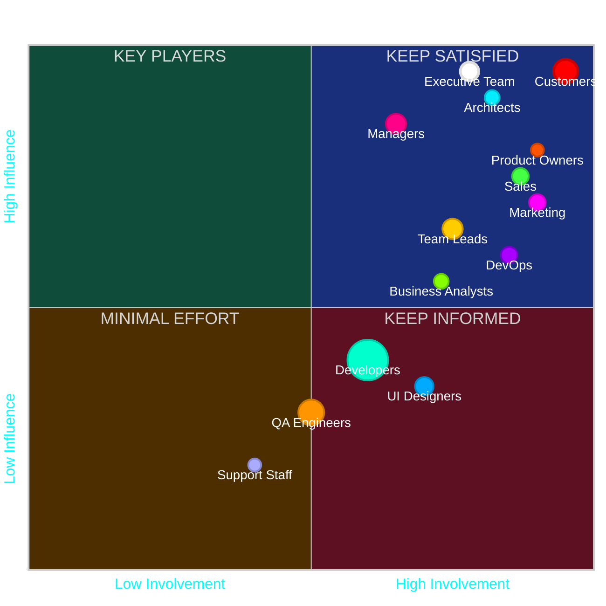

# IT Software Organization Stakeholder Map

## Interactive Visualization

## Stakeholder Breakdown

### Technical Roles (194 total staff)

| Role | Headcount | % of Org | Visual Weight |
|------|-----------|----------|--------------|
| Developers | 120 | 60% | ⬤⬤⬤⬤⬤⬤ |
| QA Engineers | 35 | 17.5% | ⬤⬤ |
| UI Designers | 15 | 7.5% | ⬤ |
| DevOps | 10 | 5% | ▲ |
| Architects | 8 | 4% | ▲ |
| Support Staff | 6 | 3% | ● |

### Leadership Roles

| Role | Headcount | % of Org | Visual Weight |
|------|-----------|----------|--------------|
| Managers | 18 | 9% | ⬤ |
| Team Leads | 18 | 9% | ⬤ |
| Business Analysts | 8 | 4% | ▲ |
| Product Owners | 6 | 3% | ● |

### External Stakeholders

| Role | Significance | Strategic Value |
|------|-------------|----------------|
| Customers | ★★★★★ | Ultimate value judges, highest influence |
| Executive Team | ★★★★★ | Strategic direction and funding |
| Marketing | ★★★★ | Product positioning and messaging |
| Sales | ★★★★ | Revenue generation and market feedback |

## Stakeholder Strategy

### Key Players (Top Right)
- **Customers:** Highest influence, critical to product success
- **Executive Team:** Strategic direction and resource allocation
- **Architects:** Technical vision and architectural governance
- **Managers:** Operational authority and resource management
- **Sales & Marketing:** Market interface and customer acquisition
- **Product Owners:** Product direction and prioritization

### Keep Satisfied (Top Left)
- No current staff in this quadrant
- Potential area for vendors, consultants, or contractors

### Keep Informed (Bottom Right)
- **Developers:** Core workforce implementing solutions
- **Team Leads:** Day-to-day implementation leadership
- **UI Designers:** User experience and interface design
- **DevOps:** Deployment pipeline and infrastructure
- **Business Analysts:** Requirements gathering and documentation

### Minimal Effort (Bottom Left)
- **QA Engineers:** Quality verification processes
- **Support Staff:** Maintenance and user assistance

## Stakeholder Management Approach

### Engagement Strategy

1. **High-Priority Stakeholders (Key Players)**
   - Regular structured updates (weekly/biweekly)
   - Direct involvement in decision-making processes
   - Proactive engagement on strategic matters

2. **Medium-Priority Stakeholders (Keep Informed)**
   - Regular status updates through established channels
   - Involvement in relevant tactical decisions
   - Clear communication of how their work impacts objectives

3. **Lower-Priority Stakeholders (Minimal Effort)**
   - Standard communication via team leads
   - Process-based engagement rather than custom approaches
   - Efficient knowledge-sharing mechanisms

### Implementation Guidelines

- **Communication Cadence:** Establish regular touchpoints with Key Players
- **Decision Framework:** Create clear RACI matrix based on quadrant positioning
- **Feedback Loops:** Design feedback mechanisms appropriate to stakeholder influence
- **Resource Allocation:** Prioritize engagement resources based on quadrant position

---

*Note: This stakeholder map represents a snapshot of organizational dynamics and may need periodic reassessment as roles and relationships evolve.*
